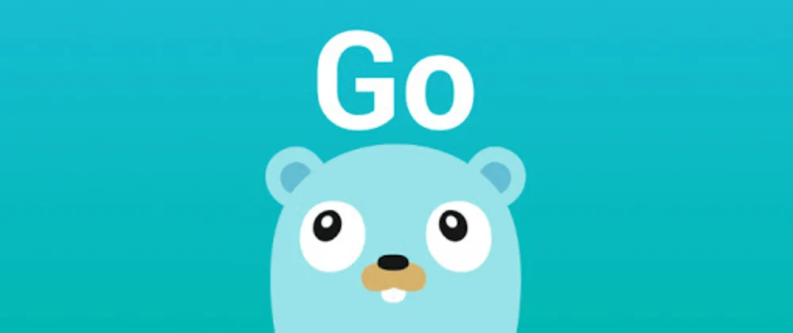

# ToDo App

- Um CLI ToDo App usando a linguagem **Go**.
- Com o intuito de aprender a syntax de **Go**.
- O **Go** foi criado no Google em 2007 e, desde então, 
as equipes de engenharia do **Go**ogle 
adotaram o Go para criar produtos e serviços em grande escala.
